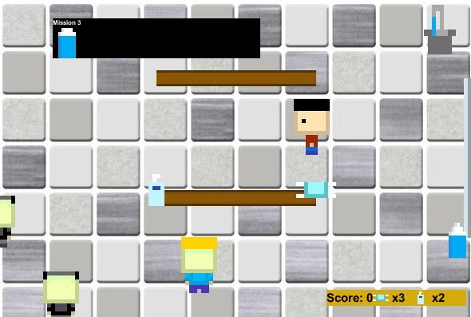

# 6-ft-apart

What if there was a game that is as fun as it is educational about the COVID-19 Pandemic that also promotes social distancing and other infection-prevention techniques? 😯

Don't go outside! Play a game that simulates the stress and anxiety of being outside by playing as a person inside the most hectic of places right now instead: the grocery store. 🏪

## How to Use
Go to https://www.greenfoot.org/scenarios/25757 to play! Click `Run` to start the scenario 🎮

If you'd like to tinker 👩‍💻 with the source code: 
1. Download [Greenfoot](https://www.greenfoot.org/download) if you don't have it already
2. Clone the repo: `git clone https://github.com/albertlai431/6-ft-apart`
3. Go to project directory: `cd 6-ft-apart`
4. Open `project.greenfoot`

## Instructions
The objective of the game is to complete missions by collecting food items! 🍎 In each mission, the items to be collected are specified in the mission box. After the mission is complete, the next one is provided! 

Avoid the shoppers! If you come within 9 feet of one, an orange circle will pop up. If you go within 6 feet, a timer will pop up. Run to the washroom! If you make it in time, *whew*, you're safe. 😪 If not, you lose a hand sanitizer! Lose all your hand sanitizers, you're infected. Game over! 🦠

Both masks and sanitizers can also be collected. Masks can be used for immunity for a single mission. 😷

**Controls:** `WASD` to move, `M` to activate mask for the current mission. 

Are you ready to complete your missions? Great, let's go! 😃

## Credits
This fun project was built during [TOHACKS](https://devpost.com/software/6-feet-apart) with [Seven Jang](https://github.com/sevenj7), [Ethan Kang](https://github.com/Eathem), and [Enoch Poon](https://github.com/EnochPoon). The incredible graphics were created solely by [Ethan Kang](https://github.com/Eathem). 